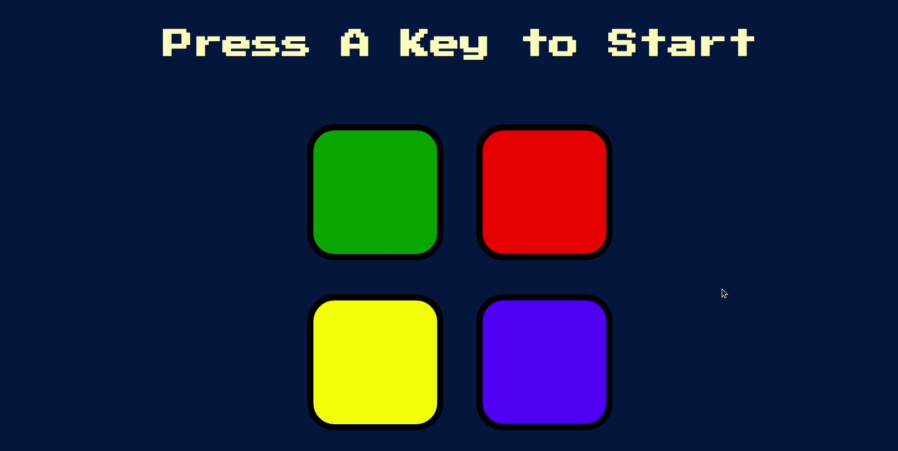

# The-Simon-Game
Test the limits of your short-term memory with a **game of Simon!**
 
 

 
 
## Instructions
1. You'll be shown a pattern in the form of flashing buttons which you have to re-enter.
2. At each level a button will be added to the pattern to increase the difficulty.
3. Make it as far as you can without making a mistake.
 
All the best!
